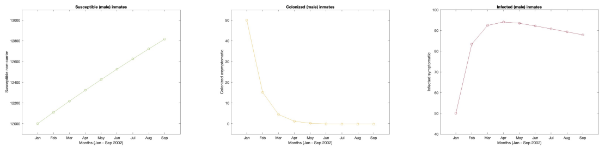

```{r, echo=FALSE, eval=FALSE}
# setwd("I:/My Drive/Spring 2022/MAT 124/final/MAT124_Final")
```

```{css, echo =FALSE}

h1.title {
  font-size: 38px;
  color: SteelBlue;
  text-align: center;
}
h4.author { 
    font-size: 18px;
  font-family: "Times New Roman", Times, serif;
  color: black;
  text-align: center;
}
h4.date { 
  font-size: 18px;
  font-family: "Times New Roman", Times, serif;
  color: black;
  text-align: center;
}
</style>
```

# <span style="color: SteelBlue;"> Introduction </span> {#intro}

You have probably heard of a "Staph Infection", but why is this seemingly common bacterial skin infection becoming a much bigger deal? The simple answer is that the bacteria which causes these skin infections, *Staphylococcus aureus*, has been evolving to develop resistance against the antibiotics which are used to treat it. [@whatsMRSA] This new distinct type of *S. aureus* has been deemed Methicillin-resistant *Staphylococcus aureus*, commonly referred to as MRSA. MRSA first started appearing in healthcare settings, where it caused mortality for hospitalized individuals. However, in the early 1990's a biologically distinct type of MRSA began breaking out in the the greater community, causing severe infections and even mortality among individuals who did not exhibit ill health or risk factors associated with early death. [@LAjail] Thus, we now have two types of MRSA: HA-MRSA (healthcare-associated MRSA), and CA-MRSA (community-associated MRSA).

For the studies I conducted along with Ryan Campbell and Aditya Kurkut, we took particular interest in CA-MRSA. Those community members who are at highest risk of infection by MRSA are those in densely populated settings with many shared textiles or possibility of shared contact. [@LAjail] This can include day cares, sports teams, correctional facilites, homeless populations, military barracks and other similar populations. CA-MRSA has been spreading with increasing intensity across the globe, evolving and becoming more difficult to treat with the passing of time. [@mt2Main] 

In an attempt to better understand this ever relevant pathogen, we took a deep dive into mathematically modeling its spread as well as its evolution. To this end, we broke our work into two midterms: Midterm 1 (Section \@ref(mt1)) where we use a compartment model and $R_0$ analysis to reproduce results from @LAjail, and Midterm 2 (Section \@ref(mt2)) where we followed the evolution of Sequence Type 8 (ST8) *S. aureus* on its evolutionary journey from a Methicillin-susceptible ancestor (MSSA) in Europe, to the hyper virulent MRSA strain, USA300, which is now spreading globally. For this second study we attempt to reproduce results from @mt2Main. In this paper, I will summarize our findings from the first two studies, as well as introduce a final study (Section \@ref(final)) on the mecI gene of *S. aureus*, which plays a significant role in the bacteria's resistance to Methicillin. [@repressor]

# <span style="color: SteelBlue;"> Midterm 1: Compartment Model Analysis </span> {#mt1}

## <span style="color: SteelBlue;"> Introduction: Midterm 1 </span> {#introMT1}

For midterm 1 [@mt1], we followed a study called *Modelling an outbreak of an emerging pathogen* by @LAjail. This gave us a chance to examine one of those MRSA hotbeds mentioned in Section \@ref(intro), a jail. Not just any jail, but the largest jail in the world, the LA County Jail. [@LAjail] In the course of this study, Ryan evaluated the approximate solution curves of the differential equations shown in Figure \@ref(fig:compartment), using the Runge-Kutta Method. With some collaboration from Ryan and I, Aditya implemented the ODE45 Integration Technique. I derived the reproduction number $R_0$, using the methods published by @R0 and then simulated 1,000 sample values for $R_0$ based on pseudo-randomly varying parameter values. 

```{r compartment,fig.align='center', fig.cap='CA-MRSA: compartment model (image by Ryan Campbell, model by Kajita, et al)', echo=FALSE,warning=FALSE,out.width='60%',out.height='60%'}
knitr::include_graphics("figures/compartment.png")
```

```{r params,fig.align='center', fig.cap='Parameters (image by Riley Adams model by Kajita, et al)', echo=FALSE, warning=FALSE, out.width='60%', out.height='50%'}
knitr::include_graphics("figures/parameters.png")
```

## <span style="color: SteelBlue;"> Results: Midterm 1 </span>{#resMT1}

**$R_0$ Analysis:** I used the methods developed by @R0 to thoroughly derive, and successfully reproduce the equation for the basic reproduction number of this model as found by @LAjail and shown in Equation \@ref(eq:rnaught). I also explored an alternate method for deriving $R_0$ which lends itself to a convenient biological interpretation. I looked at the three possible ways individuals in the jail population could exit the Colonized compartment of the model, and then multiplied each by how many inmates will take this route. In this sense, each route out of the Colonized class had its own $R_0$ value, and the overall reproduction number was the weighted average of the three. As in Equation \@ref(eq:average)

\begin{equation}
  R_0=\frac{c\beta_C + (\rho \phi c \beta_I)/ S}{\alpha + \rho \phi + \delta}
  (\#eq:rnaught)
\end{equation}

\begin{align}
  R_0 &= q_1 R_0^1 + q_2 R_0^2 +  q_3 R_0^3 \\
  &= (\frac{\alpha}{\alpha + p\phi + \delta})(\frac{c\beta_C}{\alpha + p\phi + \delta})+(\frac{\delta}{\alpha + p\phi + \delta})(\frac{c\beta_C}{\alpha + p\phi + \delta})+(\frac{p\phi}{\alpha + p\phi + \delta})(\frac{c\beta_C}{\alpha + p\phi + \delta} + \frac{c\beta_I}{\delta})
  (\#eq:average)
\end{align}

I wrote code in R to collect $2,000$ pseudo-random samples ($1,000$ for male, $1,000$ for female) of values for each parameter in the $R_0$ equation. I used the ranges of values estimated by @LAjail, as depicted in Figure \@ref(fig:range). Then, I utilized Equation \@ref(eq:rnaught) to calculate $1000$ sample $R_0$ and conduct an analysis on the results. See Figure \@ref(fig:histograms). We discovered the mean $R_0$ for males was $3.27$, while the mean $R_0$ for females was $0.71$. The results for the females were very close to those achieved by @LAjail, while our mean for males was fairly higher.


```{r range,fig.align='center', fig.cap='Estimated parameter Ranges (image by Adams and Kurkut, estimates by Kajita, et al)', echo=FALSE, warning=FALSE, out.width='60%', out.height='50%'}
knitr::include_graphics("figures/paramRange.png")
```

```{r histograms, fig.cap='Histograms for 1000 Randomly Generated R0 by Varying Parameter Values. Male Population (Left), Female Population (Right)', fig.show = 'hold', fig.align = 'center', echo=FALSE, warning=FALSE, out.width='49%', out.height='50%'}
knitr::include_graphics(c("figures/RnaughtHistMale.png", "figures/RnaughtHistFemale.png"))
```

**ODE45:** Aditya Kurkut implemented the ODE45 function in the MATLAB software to integrate the differential equations in the model. To do so he input the Differential Equations, a range of time and some initial values which we deemed reasonable estimations. The results are depicted in Figure \@ref(fig:ode45).


```{r ode45, fig.align='center', fig.cap="Solution Curve for the ODE's in the Model (image by Aditya Kurkut)", echo=FALSE, warning=FALSE, out.width='60%', out.height='50%'}
knitr::include_graphics("figures/ode45.png")
```

**Runge-Kutta:** Ryan Campbell used the Runge-Kutta method to approximate a solution curve for each differential equation. In doing so, a recursive, step-wise process was applied to some reasonable initial conditions for the model. The iterations of this process were made possible by the code Campbell produced in the MATLAB software using a "for loop" over 8 iterations, to represent the time steps at each month of the 9 month long study. The process was carried out seperately for male and female inmates. The results are depicted in Figure \@ref(fig:rungeM) and Figure \@ref(fig:rungeF). 

```{r rungeM, fig.align='center', fig.cap="Runge-Kutta Numerical Method for Approximating Solution Curves | Male Inmates (image by Ryan Campbell)", echo=FALSE, warning=FALSE, out.width='60%', out.height='50%'}

```
```{r rungeF, fig.align='center', fig.cap="Runge-Kutta Numerical Method for Approximating Solution Curves | Female Inmates (image by Ryan Campbell)", echo=FALSE, warning=FALSE, out.width='60%', out.height='50%'}
knitr::include_graphics("figures/rungeFemale.png")
```

## <span style="color: SteelBlue;"> Discussion: Midterm 1 </span> {#discMT1}

The differential equations model and the numerical methods we used to analyze it in Midterm 1 helped us understand how CA-MRSA spreads in susceptible populations. Our $R_0$ analysis indicated how varying values of the parameters in the model can effect the MRSA's ability to reproduce and spread. These parameters could be closely examined to determine which ones we can affect to curb the spread, and inform policy at institutions like correctional facilities. We saw in Ryan Campbell's Runge-Kutta analysis that differing initial conditions can lead to drastically different outcomes, thus further scrutiny of this model and the behavior of MRSA can inform onboarding processes to correctional facilities to minimize introduction of this pathogen into the system. In the same vain, the jail is not a closed system. The average term is short and individuals are released back to the community in one of the 3 compartments of the model. Meaning jails can be a source population for MRSA into the larger population. This study can highlight for the public, an awareness that it is important to consider the conditions (crowding, hygeine, etc.) and standards of living for those in our society who are imprisoned because it has an effect on the health of the greater society.

# <span style="color: SteelBlue;"> Midterm 2: Evolutionary Analysis </span> {#mt2}

## <span style="color: SteelBlue;"> Introduction: Midterm 2 </span> {#introMT2}

For Midterm 2 [@mt2], we examined the evolution of ST8 *S. aureus*. We implemented Multiple Sequence Alignment of the DNA, Phylogenetic Tree Analysis and Topological Data Analysis. In doing so, we attempted (with some success) to recreate results from a study titled "Origin, evolution, and global transmission of community-acquired Staphylococcus aureus ST8" by @mt2Main. By following the evolution of ST8 *S. aureus* we can track its origins in Denmark and see how it branched out and spread through massive immigration events and World Wars into the United States where it circulated and underwent mutations which gave the bacteria its resistance to Methicillin. From the United States, this new highly virulent strain has been exported globally. It has even branched into two distinct main types known as USA300-NAE (North American Epidemic) and USA300-SAE (South American Epidemic), which are now circulating heavily as far as Africa, and Australia. [@mt2Main]

## <span style="color: SteelBlue;"> Results: Midterm 2 </span> {#resMT2}

To analyze the phylogeny of ST8 *S. aureus*, we used the data studied by @mt2Main, which contained 224 samples from the DNA of different ST8 *S. aureus* strains. Since @mt2Main had already aligned the sequences against the chromosome of the *S. aureus* TCH1516 ST8 reference genome, using the Burrows-Wheeler Aligner, we did not get a chance to actually perform the sequence alignment ourselves. Although, I ran the `AlignSeq()` function from the R software package "DECIPHER" anyways, because it was a necessary step in our code. This did not have any effect of the positioning of our already aligned DNA sequences. Using The R software, guidance from the github repository authored by @github and various packages which can be found in the appendix of @mt2, I first computed a distance matrix of the pairwise distance between each of the 224 sequences as visualized in Figure \@ref(fig:dist)

```{r dist, fig.cap='Distance Matrix: darker grey is more distant', fig.align='center', echo=FALSE, warning=FALSE, out.width='100%', out.height='100%'}
knitr::include_graphics("figures/dist.png")
```

I then implemented the tree estimation method created by @snei known as "Neighbor-Joining". This was performed using the `ape::nj()` function in R, but the *neighbor-joining matrix* $D^*$ is defined as the matrix which, given an $n \times n$ distance matrix $D$, is

$$ D^*_{i,j} = (n-2)\cdot D_{i,j} - TotalDistance_D(i) - TotalDistance_D(j) $$,
where $TotalDistance_D(i)$ is the sum of distances from $i$ to all other leaves.

This matrix $D^*$ was then run through various plotting functions to produces the horizontal phylogram in Figure \@ref(fig:phyloHoriz) and circular phylogram in Figure \@ref(fig:phyloCircle). The phylograms were not an exact match to those produced by @mt2Main, however, they were quite similar. Both phylogenies had the highly virulent USA300 strain peppered throughout. Further, Denmark strains remaine near the root. Two distinct African clades were apparent, and one had close relation between Gabon and Nigeria strains with USA300 as a recent ancestor. We also had distinctly North American and South American clusters, depicting the 2 main USA300 epidemic types (NAE and SAE).

```{r phyloHoriz, fig.cap='Phylogram', fig.align='center', echo=FALSE,warning=FALSE,out.width='100%',out.height='100%'}
knitr::include_graphics("figures/phyloHoriz.png")
```
```{r phyloCircle, fig.cap='Phylogram', fig.align='center', echo=FALSE,warning=FALSE,out.width='100%',out.height='100%'}
knitr::include_graphics("figures/phyloCircle.png")
```

Next, Ryan Campbell performed Topological Data Analysis on the same data set to gain further insight on the ancestral paths of ST8. This analysis was also performed using the R software and the same distance matrix visualized in Figure \@ref(fig:dist), this time using the "TDAstats" package with `calculateHomology()` function. Ryan set the dimensions to $1$, threshold to $-1$, format to 'distmat' and standardization to 'FALSE', which gave us the calculated homologies of the 224 strains of ST8. From there, Campbell produced the plots in Figure \@ref(fig:TDAplots). The left plot is the barcode plot which is varified by the same information in the persistence plot on the right. 

```{r TDAplots, fig.cap='Barcode Plot (left) and persistance plot (right)', fig.show = 'hold', fig.align = 'center', echo=FALSE,warning=FALSE,out.width='49%',out.height='65%'}
knitr::include_graphics(c("figures/TDAbarcode.png", "figures/TDApersist.png"))
```

## <span style="color: SteelBlue;"> Discussion: Midterm 2 </span> {#discMT2}

The analysis performed on the phylogeny of ST8 gave us insight into the history of this bacteria and how highly virulent CA-MRSA has risen to global prominence. Our phylogenetic tree illustrates how USA300 has given rise to many more antibiotic resistant strains of ST8 MRSA which are now circulating on other continents. The topological data further illustrates an acceleration in the mutation of CA-MRSA strains, particularly around the center of the graph where the "slope" is especially steep. As resistance to antibiotics becomes more and more prevelant, we will have to find new ways to treat infections caused by bacteria. Scrutiny should be placed on the allocation of antibiotics to avoid over using them and creating stronger resistance. Further, more research can be conducted into the mechanisms of the bacteria which cause its resistance to antibiotics. (We will examin one such mechanism in Section \@ref(final)). 

In an exciting new frontier, @phage very recently published a study in which mycobacteriaphages we employed to successfully treat an infection in the lung of a male patient. These phages (essentially viruses for bacteria) were engineered in such a way as to more effectively lyse the *M. abcessus* causing the infection. Although this type of treatment has had varying success, with bacteria also developing restance to phages, [@phage] further research in this area could provide us with more tools to fight this epidemic of MRSA as the problem grows more severe.

# <span style="color: SteelBlue;"> Final: 3D Protein Structure </span> {#final}

```{r mecPics, fig.cap='Structure of the repressor protein encoded by the mecI gene', fig.show = 'hold', fig.align = 'center', echo=FALSE, warning=FALSE, out.width='49%', out.height='65%'}
knitr::include_graphics(c("RileysProjectFiles/proteinPics/mecI_1.png", "RileysProjectFiles/proteinPics/mecI_2.png"))
```
```{r fancymec, fig.cap='Structure of the repressor protein encoded by the mecI gene', fig.show = 'hold', fig.align = 'center', echo=FALSE, warning=FALSE, out.width='49%', out.height='65%'}
knitr::include_graphics(c("RileysProjectFiles/proteinPics/mecI_3.png", "RileysProjectFiles/proteinPics/mecI_4.png","RileysProjectFiles/proteinPics/mecI_5.png"))
```
```{r allPlots, fig.cap='Plots generated by AlphaFold2', fig.align='center', echo=FALSE, warning=FALSE, out.width='100%', out.height='100%'}

```

# <span style="color: SteelBlue;"> References </span>

