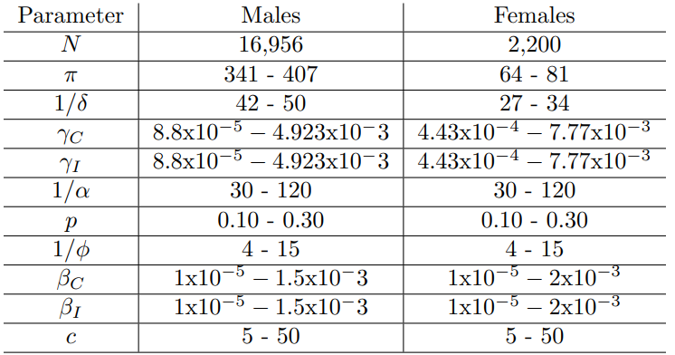

```{r, echo=FALSE, eval=FALSE}
# setwd("I:/My Drive/Spring 2022/MAT 124/final/MAT124_Final")
```

```{css, echo =FALSE}

h1.title {
  font-size: 38px;
  color: SteelBlue;
  text-align: center;
}
h4.author { 
    font-size: 18px;
  font-family: "Times New Roman", Times, serif;
  color: black;
  text-align: center;
}
h4.date { 
  font-size: 18px;
  font-family: "Times New Roman", Times, serif;
  color: black;
  text-align: center;
}
</style>
```

# <span style="color: SteelBlue;"> Introduction </span> {#intro}

You have probably heard of a "Staph Infection", but why is this seemingly common bacterial skin infection becoming a much bigger deal? The simple answer is that the bacteria which causes these skin infections, *Staphylococcus aureus*, has been evolving to develop resistance against the antibiotics which are used to treat it. [@whatsMRSA] This new distinct type of *S. aureus* has been deemed Methicillin-resistant *Staphylococcus aureus*, commonly referred to as MRSA. MRSA first started appearing in healthcare settings, where it caused mortality for hospitalized individuals. However, in the early 1990's a biologically distinct type of MRSA began breaking out in the the greater community, causing severe infections and even mortality among individuals who did not exhibit ill health or risk factors associated with early death. [@LAjail] Thus, we now have two types of MRSA: HA-MRSA (healthcare-associated MRSA), and CA-MRSA (community-associated MRSA).

For the studies I conducted along with Ryan Campbell and Aditya Kurkut, we took particular interest in CA-MRSA. Those community members who are at highest risk of infection by MRSA are those in densely populated settings with many shared textiles or possibility of shared contact. [@LAjail] This can include day cares, sports teams, correctional facilites, homeless populations, military barracks and other similar populations. CA-MRSA has been spreading with increasing intensity across the globe, evolving and becoming more difficult to treat with the passing of time. [@mt2Main] 

In an attempt to better understand this ever relevant pathogen, we took a deep dive into mathematically modeling its spread as well as its evolution. To this end, we broke our work into two midterms: Midterm 1 (Section \@ref(mt1)) where we use a compartment model and $R_0$ analysis to reproduce results from @LAjail, and Midterm 2 (Section \@ref(mt2)) where we followed the evolution of Sequence Type 8 (ST8) *S. aureus* on its evolutionary journey from a Methicillin-susceptible ancestor (MSSA) in Europe, to the hyper virulent MRSA strain, USA300, which is now spreading globally. For this second study we attempt to reproduce results from @mt2Main. In this paper, I will summarize our findings from the first two studies, as well as introduce a final study (Section \@ref(final)) on the mecI gene of *S. aureus*, which plays a significant role in the bacteria's resistance to Methicillin. [@repressor]

# <span style="color: SteelBlue;"> Midterm 1: Compartment Model Analysis </span> {#mt1}

## <span style="color: SteelBlue;"> Introduction: Midterm 1 </span> {#introMT1}

For midterm 1 [@mt1], we followed a study called *Modelling an outbreak of an emerging pathogen* by @LAjail. This gave us a chance to examine one of those MRSA hotbeds mentioned in Section \@ref(intro), a jail. Not just any jail, but the largest jail in the world, the LA County Jail. [@LAjail] In the course of this study, Ryan evaluated the approximate solution curves of the differential equations shown in Figure \@ref(fig:compartment), using the Runge-Kutta Method. With some collaboration from Ryan and I, Aditya implemented the ODE45 Integration Technique. I derived the reproduction number $R_0$, using the methods published by @R0 and then simulated 1,000 sample values for $R_0$ based on pseudo-randomly varying parameter values. 

```{r compartment,fig.align='center', fig.cap='CA-MRSA: compartment model (image by Ryan Campbell, model by Kajita, et al)', echo=FALSE,warning=FALSE,out.width='60%',out.height='60%'}
knitr::include_graphics("figures/compartment.png")
```

```{r params,fig.align='center', fig.cap='Parameters (image by Riley Adams model by Kajita, et al)', echo=FALSE, warning=FALSE, out.width='60%', out.height='50%'}
knitr::include_graphics("figures/parameters.png")
```

## <span style="color: SteelBlue;"> Results: Midterm 1 </span>{#resMT1}

**$R_0$ Analysis:** I used the methods developed by @R0 to thoroughly derive, and successfully reproduce the equation for the basic reproduction number of this model as found by @LAjail and shown in Equation \@ref(eq:rnaught). I also explored an alternate method for deriving $R_0$ which lends itself to a convenient biological interpretation. I looked at the three possible ways individuals in the jail population could exit the Colonized compartment of the model, and then multiplied each by how many inmates will take this route. In this sense, each route out of the Colonized class had its own $R_0$ value, and the overall reproduction number was the weighted average of the three. As in Equation \@ref(eq:average)

\begin{equation}
  R_0=\frac{c\beta_C + (\rho \phi c \beta_I)/ S}{\alpha + \rho \phi + \delta}
  (\#eq:rnaught)
\end{equation}

\begin{align}
  R_0 &= q_1 R_0^1 + q_2 R_0^2 +  q_3 R_0^3 \\
  &= (\frac{\alpha}{\alpha + p\phi + \delta})(\frac{c\beta_C}{\alpha + p\phi + \delta})+(\frac{\delta}{\alpha + p\phi + \delta})(\frac{c\beta_C}{\alpha + p\phi + \delta})+(\frac{p\phi}{\alpha + p\phi + \delta})(\frac{c\beta_C}{\alpha + p\phi + \delta} + \frac{c\beta_I}{\delta})
  (\#eq:average)
\end{align}

I wrote code in R to collect $2,000$ pseudo-random samples ($1,000$ for male, $1,000$ for female) of values for each parameter in the $R_0$ equation. I used the ranges of values estimated by @LAjail, as depicted in Figure \@ref(fig:range). Then, I utilized Equation \@ref(eq:rnaught) to calculate $1000$ sample $R_0$ and conduct an analysis on the results. See Figure \@ref(fig:histograms). We discovered the mean $R_0$ for males was $3.27$, while the mean $R_0$ for females was $0.71$. The results for the females were very close to those achieved by @LAjail, while our mean for males was fairly higher.


```{r range,fig.align='center', fig.cap='Estimated parameter Ranges (image by Adams and Kurkut, estimates by Kajita, et al)', echo=FALSE, warning=FALSE, out.width='60%', out.height='50%'}

```

```{r histograms, fig.cap='Histograms for 1000 Randomly Generated R0 by Varying Parameter Values. Male Population (Left), Female Population (Right)', fig.show = 'hold', fig.align = 'center', echo=FALSE, warning=FALSE, out.width='49%', out.height='50%'}
knitr::include_graphics(c("figures/RnaughtHistMale.png", "figures/RnaughtHistFemale.png"))
```

**ODE45:** Aditya Kurkut implemented the ODE45 function in the MATLAB software to integrate the differential equations in the model. To do so he input the Differential Equations, a range of time and some initial values which we deemed reasonable estimations. The results are depicted in Figure \@ref(fig:ode45).


```{r ode45, fig.align='center', fig.cap="Solution Curve for the ODE's in the Model (image Aditya Kurkut)", echo=FALSE, warning=FALSE, out.width='60%', out.height='50%'}
knitr::include_graphics("figures/ode45.png")
```

**Runge-Kutta:** Ryan Campbell used the Runge-Kutta method to approximate a solution curve for each differential equation. In doing so, a recursive, step-wise process was applied to some reasonable initial conditions for the model. The iterations of this process were made possible by the code Campbell produced in the MATLAB software using a "for loop" over 8 iterations, to represent the time steps at each month of the 8 month long study. The process was carried out seperately for male and female inmates. The results are depicted in Figure 

```{r rungeM, fig.align='center', fig.cap="Solution Curve for the ODE's in the Model (image Aditya Kurkut)", echo=FALSE, warning=FALSE, out.width='60%', out.height='50%'}
knitr::include_graphics("figures/ode45.png")
```

## <span style="color: SteelBlue;"> Discussion: Midterm 1 </span> {#discMT1}


# <span style="color: SteelBlue;"> Midterm 2: Evolutionary Analysis </span> {#mt2}

## <span style="color: SteelBlue;"> Introduction: Midterm 2 </span> {#introMT2}


## <span style="color: SteelBlue;"> Results: Midterm 2 </span> {#resMT2}


## <span style="color: SteelBlue;"> Discussion: Midterm 2 </span> {#discMT2}


# <span style="color: SteelBlue;"> Final: 3D Protein Structure </span> {#final}


# <span style="color: SteelBlue;"> References </span>

