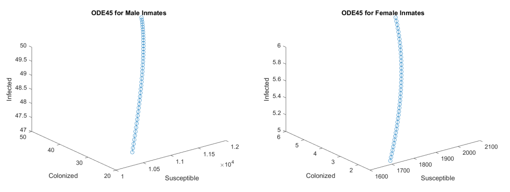

```{r, echo=FALSE, eval=FALSE}
# setwd(/Users/ryancampbell/Documents/GitHub/MAT124_Final")
```

```{css, echo =FALSE}

h1.title {
  font-size: 38px;
  color: DarkOliveGreen;
  text-align: center;
}
h4.author { 
    font-size: 18px;
  font-family: "Times New Roman", Times, serif;
  color: black;
  text-align: center;
}
h4.date { 
  font-size: 18px;
  font-family: "Times New Roman", Times, serif;
  color: black;
  text-align: center;
}

</style>
```

# <span style="color: DarkOliveGreen;"> Introduction </span>{#intro}
In this paper, I review mathematical studies of methicillin-resistant *Staphylococcus aureus*, that Riley Adams, Aditya Kurkut and myself all studied through the course of the Spring 2022 quarter at University of California, Davis for the MAT 124 course. *Staphylococcus aureus* is a fairly well known bacteria since it is the cause of the commonly-known "staph infection", which is a type of skin infection. However, *Staphylococcus aureus* evolved to become resistant to a lot of $\beta$-lactam antibiotics which makes it particularly difficult to treat, and is known as methicillin resistant *Staphylococcus aureus* (MRSA) [@whatsMRSA]. MRSA originated in healthcare settings where it posed a particular threat for hospitalized individuals, since admitted patients are already sick and immunocompromised. However, during 1990's MRSA broke out into the greater community, causing severe infections and even death among individuals who were not immunocompromised and in most regards, healthy [@LAjail]. This public type of MRSA has been found to be biologically distinct, and so we distinguish between the two types of MRSA by referring to HA-MRSA (healthcare-associated MRSA), and CA-MRSA (community-associated MRSA). MRSA in and of itself is physically similar to *Staphylococcus aureus*, since it is still a gram-positive, non-spore forming type of spherical bacteria, which form grape-like clusters when viewed under a microscope.

We focused on CA-MRSA for these projects, since the risk is generalized to the public. It should be noted that community members at highest risk of infection by MRSA are those in densely populated settings with many shared textiles or possibility of shared contact, or poor hygiene [@LAjail]. Densely populated settings such as correctional facilities, homeless populations, or military barracks are at risk as well as settings such as a high-contact sports team, day cares and other similar populations. CA-MRSA has been spreading with increasing intensity across the globe, evolving and becoming more difficult to treat with the passing of time. [@mt2Main] 

To first get an understanding on the spread of CA-MRSA, we took a deep dive into a mathematical model of its spread in a community. This was done in our Midterm 1 report (Section \@ref(mt1)) where we used a compartmental model and $R_0$ analysis to reproduce results from @LAjail. After we studied an example of its spread in a community, we researched the evolution of Sequence Type 8 (ST8) *S. aureus* from it's origin as a Methicillin-susceptible ancestor (MSSA) in Europe, to the hyper virulent MRSA strain we know it to be today, USA300. To do this, we followed and attempted to reproduce some of the results from @mt2Main as well as included a topological data analysis method we learned in our class. 

As a further understanding of CA-MRSA, and MRSA in general, I studied the mecA gene of *S. aureus*, which is the gene sequence that creates the penicillin-binding protein, PBP 2a, which gives MRSA some of its methicillin-resistance characteristics [@mecAgene]. 


# <span style="color: DarkOliveGreen;"> Midterm 1: Compartment Model Analysis </span> {#mt1}
## <span style="color: DarkOliveGreen;"> Introduction: Midterm 1 </span> {#introMT1}

To start, we will examine the compartmental model, which categorized the inmates into 3 classes: Susceptible (no infection), Colonized (asymptomatic, contagious) and Infected (symptomatic infection) [@LAjail]. The study by @LAjail is important to help understand important contributing factors in the spreadof MRSA within LA County jail as well as the implications this may have for the outside community, since inmates only reside in the jail for an average of one month, they can leave while still contagious. The model also considers the dynamis of movement between compartments and into and out of the outside community. To study this, we reproduced the methods used in the study for calculating the disease reproductive number (R0), in greater detail using the method developed by @R0. Additionally, we also implemented the ODE45 function in MATLAB to integrate the three ordinary differential equations found in our compartmental model, shown in figure \@ref(fig:compartment) and in figure \@ref(fig:ODEs) and the Runge-Kutta method to find potential solution curves of the population dynamics. We included a pretty thorough $R_0$ analysis as well, which was performed by using the methods published by @R0 and simulating 1,000 sample values for $R_0$ based on pseudo-randomly varying parameter values in figure \@ref(fig:parameters).  

```{r ODEs,fig.align='center', fig.cap='CA-MRSA: Ordinary Differential Equations as depicted in model by Kajita, et al', echo=FALSE,warning=FALSE,out.width='60%',out.height='60%'}
knitr::include_graphics("figures/ODEs.png")
```

```{r compartment,fig.align='center', fig.cap='CA-MRSA: compartment model (image by Ryan Campbell, model by Kajita, et al)', echo=FALSE,warning=FALSE,out.width='60%',out.height='60%'}

```

```{r parameters,fig.align='center', fig.cap='Parameters (image by Riley Adams model by Kajita, et al)', echo=FALSE,warning=FALSE,out.width='60%',out.height='60%'}
knitr::include_graphics("figures/parameters.png")
```


## <span style="color: DarkOliveGreen;"> Results: Midterm 1 </span>{#resMT1}

**ODE45:** For the most part, Aditya Kurkut worked on understanding and implementing the ODE45 function in the MATLAB software to integrate the differential equations in the model. We collaborated on the code he used since I was a bit more familiar with MATLAB syntax, but he studied it and wrote the code for the implementation of the technique. The ODE45 function required inputs of our Differential Equations, our parameters in \@ref(fig:parameters) some initial values which we deemed reasonable estimations. The results are depicted in Figure \@ref(fig:ode45).


```{r ode45, fig.align='center', fig.cap="Solution Curve for the ODE's in the Model (image by Aditya Kurkut)", echo=FALSE, warning=FALSE, out.width='60%', out.height='50%'}

```

**Runge-Kutta:** I was the sole contributor to the Runge-Kutta method we implemented to approximate a solution curve for each differential equation. Notably, this was not a method detailed in @LAjail, but I used methods we covered in class and coded it in MATLAB. In doing so, I used an iterative process with some reasonable initial conditions and used "for loop" in MATLAB to approximate the value at each time step for each month of the 9 month long study detailed in @LAjail. I separated the code into two chunks, one for the analysis on female inmates and one for male inmates, since their parameter values and intiial conditions differed. The plotted results are shown in Figure \@ref(fig:rungeM) and Figure \@ref(fig:rungeF). 

```{r rungeM, fig.align='center', fig.cap="Runge-Kutta Numerical Method for Approximating Solution Curves | Male Inmates (image by Ryan Campbell)", echo=FALSE, warning=FALSE, out.width='60%', out.height='50%'}
knitr::include_graphics("figures/rungeMale.png")
```
```{r rungeF, fig.align='center', fig.cap="Runge-Kutta Numerical Method for Approximating Solution Curves | Female Inmates (image by Ryan Campbell)", echo=FALSE, warning=FALSE, out.width='60%', out.height='50%'}

```

**$R_0$ Analysis:** For the $R_0$ analysis, Riley referred to methods developed by @R0 to thoroughly derive, and successfully reproduce the equation for the basic reproduction number of this model as found by @LAjail and shown in Equation \@ref(eq:rnaught). He also took the initiative to explore an alternate method for deriving $R_0$ in order to find a relatively more intuitive biological interpretation. To do this, he observed there were only three possible ways individuals in the jail population could exit the Colonized compartment of the model, and then multiplied rate by how many inmates will take this route. For this reason, each route out of the Colonized class would have its own $R_0$ value, and the overall reproduction number was the weighted average of the three. We can see this weighted average in equation \@ref(eq:average),

\begin{equation}
  R_0=\frac{c\beta_C + (\rho \phi c \beta_I)/ S}{\alpha + \rho \phi + \delta}
  (\#eq:rnaught)
\end{equation}

\begin{align}
  R_0 &= q_1 R_0^1 + q_2 R_0^2 +  q_3 R_0^3 \\
  &= (\frac{\alpha}{\alpha + p\phi + \delta})(\frac{c\beta_C}{\alpha + p\phi + \delta})+(\frac{\delta}{\alpha + p\phi + \delta})(\frac{c\beta_C}{\alpha + p\phi + \delta})+(\frac{p\phi}{\alpha + p\phi + \delta})(\frac{c\beta_C}{\alpha + p\phi + \delta} + \frac{c\beta_I}{\delta})
  (\#eq:average)
\end{align}

Riley then wrote code in R to generate $1,000$ pseudo-random samples for each, male and female, to get values for each parameter used in the $R_0$ equation. To control the pseudo-random sampling, he restricted to ranges of values estimated by @LAjail, as depicted in Figure \@ref(fig:range). Then, he utilized Equation \@ref(eq:rnaught) to calculate $1000$ sample $R_0$ and plotted an analysis on the results, which we see in Figure \@ref(fig:histograms). From his work, he discovered the mean $R_0$ for males was $3.27$, while the mean $R_0$ for females was $0.71$. This result aligns well with the results achieved by @LAjail, although the mean $R_0$ for males was slightly larger. This could be an error in our pseudo-random sampling, since our sampled values may not precisely align with those sampled by @LAjail.

```{r range,fig.align='center', fig.cap='Estimated parameter Ranges (image by Adams and Kurkut, estimates by Kajita, et al)', echo=FALSE, warning=FALSE, out.width='60%', out.height='50%'}
knitr::include_graphics("figures/paramRange.png")
```

```{r histograms, fig.cap='Histograms for 1000 Randomly Generated R0 by Varying Parameter Values. Male Population (Left), Female Population (Right)', fig.show = 'hold', fig.align = 'center', echo=FALSE, warning=FALSE, out.width='49%', out.height='50%'}
knitr::include_graphics(c("figures/RnaughtHistMale.png", "figures/RnaughtHistFemale.png"))
```

## <span style="color: DarkOliveGreen;"> Discussion: Midterm 1 </span> {#discMT1}

Through examining the 2007 study of a CA-MRSA outbreak in LA County Jail detailed in @LAjail, we discovered a bit about the dynamics of the spread of MRSA infections, through the ODE45 integration, Runge-Kutta approximations, and $R_0$ analysis. Our most notable results were our $R_0$ analysis and our application of the Runge-Kutta methods. These two methods got us to dive deeper into the population growth dynamics, since the Runge-Kutta method showed us how the dynamics of the three model compartments can play out with differing levels of initial conditions, and the $R_0$ analysis gave us a sense of the population growth factor. These results could influence changes to institutions in the inmate on-boarding process, and ensuring access to basic hygiene and clean textiles in order to reduce the spread of the disease. This extra level of control in the on-boarding can also reduce the number of individuals who may already be colonized or infected with CA-MRSA. At its greatest extent, they may want to implement a health screening procedure which includes testing of any wounds and a short quarantine to wait for test results to come back. This obviously may not be the most practical suggestion due to the high costs of testing and ensuring adequate space in quarantining individuals before they are released to the jail's population. This is mostly because we must realize that jails are not closed systems, especially county jails where individuals are entering and leaving at a relatively high frequency. In regards to CA-MRSA, individuals arrive at the jail in one of 3 compartments, and upon departure, individuals can leave in any of the 3 compartments as well. We want to ensure our correctional facilities are not essentially acting as distribution centers for MRSA infections in our communities. Simple changes to the policies that guide the intake process for inmates, regarding hygiene, access to clean clothing, and potentially even testing and quarantine periods can likely have a significant effect on the epidemiological condition of the outside community.

# <span style="color: DarkOliveGreen;"> Midterm 2: Evolutionary Analysis </span> {#mt2}
## <span style="color: DarkOliveGreen;"> Introduction: Midterm 2 </span> {#introMT2}

For Midterm 2 [@mt2], we examined the evolution of ST8 *S. aureus*, into many different strains today, including MRSA strains and methicillin-susceptible *S. aureus* strain (MSSA). We took particular interest in the genealogy and phylogeny of MRSA strains and found a paper [@mt2Main] covering an analysis of what we were looking for. In the study of this paper, we implemented Multiple Sequence Alignment of the DNA, Phylogenetic Tree Analysis and Topological Data Analysis. We attempted to recreate the results for phylogenetic analysis as in @mt2Main, but ran into some roadblocks with resources. Despite that, the study followed the evolution of ST8 *S. aureus* and traced its origins to begin in Denmark and observed how it spread through massive immigration events and World Wars into the United States where it circulated and mutated, which is where we see beginnings of methicillin resistance characteristics. Since then, this newer and highly virulent strain, named USA300, has been biologically exported globally. As time passed, USA300 differentiated enough to necessitate a categorization for its two distinct main types known as USA300-NAE (North American Epidemic) and USA300-SAE (South American Epidemic). These two distinct strains are now circulating heavily as far as Africa, and Australia [@mt2Main]. By performing Phylogenetic Analysis and topological data analysis, we were able to examine the genetic similarity and evolution of 224 isolates of ST-8 type *S. aureus*.

## <span style="color: DarkOliveGreen;"> Results: Midterm 2 </span> {#resMT2}

To start, we chose to attempt to reproduce the phylogenetic analysis of ST8 *S. aureus* in the study by @mt2Main, where we utilized their posted datasets to begin. This dataset contained 224 samples from the DNA of different ST8 *S. aureus* strains, and listed out the sequences we used to conduct our phylogenetic and topological data analysis. Since @mt2Main had already aligned the sequences against the chromosome of the *S. aureus* TCH1516 ST8 reference genome, using the Burrows-Wheeler Aligner, we did not get a chance to actually perform the sequence alignment ourselves, but we verified that the sequences were aligned by performing an alignment using the `AlignSeqs()` function in R from the `DECIPHER` package. This output also happened to be a helpful step in our code, since the functions we used to create the phylogenetic analysis accepted the file type output from `AlignSeqs()`. We checked the sequences in dataframes before and after performing this step and observed no changes to our DNA sequences, which verified that @mt2Main already completed sequence alignment. Riley used references from the R software documentation, guidance from the github repository authored by @github and various packages which can be found in the code appendix of our midterm 2 paper [@mt2] in order to compute a distance matrix of the pairwise distance between each of the 224 sequences as visualized in Figure \@ref(fig:dist)

```{r dist, fig.cap='Distance Matrix: darker grey is more distant', fig.align='center', echo=FALSE, warning=FALSE, out.width='100%', out.height='100%'}
knitr::include_graphics("figures/dist.png")
```

Following the calculation of our distance matrix, we sought out to create a phylogenetic analysis. The method in the paper we were following [@mt2Main] used BEAST, but unfortunately we did not have the time or resources to learn how to use their software, so Riley implemented the tree estimation method created by @snei known as "Neighbor-Joining". This was performed using the `ape::nj()` function in R, but the *neighbor-joining matrix* $D^*$ is defined as the matrix which, given an $n \times n$ distance matrix $D$, is

$$ D^*_{i,j} = (n-2)\cdot D_{i,j} - TotalDistance_D(i) - TotalDistance_D(j) $$,
where $TotalDistance_D(i)$ is the sum of distances from $i$ to all other leaves.

This matrix $D^*$ was then run through various plotting functions to produce the horizontal phylogenetic tree in Figure \@ref(fig:phyloHoriz) as well as the circular phylogenetic tree in Figure \@ref(fig:phyloCircle). Noticeably, the phylogenetic trees were not exact matches to the ones produced by @mt2Main, since we used a slightly different analysis method, although they are quite similar. Both phylogenetic trees had the highly virulent USA300 strain present throughout the branches and Denmark strains remain near the root. Similarly, our method we implemented still produced two distinct African clades, where one had a close relation between Gabon and Nigeria strains with USA300 as a recent ancestor. We also had distinctly North American and South American clusters, which depict the 2 main USA300 epidemic types (NAE and SAE).

```{r phyloHoriz, fig.cap='Phylogram', fig.align='center', echo=FALSE,warning=FALSE,out.width='100%',out.height='100%'}

```
```{r phyloCircle, fig.cap='Phylogram', fig.align='center', echo=FALSE,warning=FALSE,out.width='100%',out.height='100%'}

```

Following our phylogenetic analysis, I performed Topological Data Analysis on the same data set used in our phylogenetic analysis to gain further insight on the ancestral paths of ST8. I chose to continue the analysis using the R software and utilized the same distance matrix visualized in Figure \@ref(fig:dist), and then processed the distance matrix to calculate the topological homology using the `calculateHomology()` function within the "TDAstats" package. As seen in our code appendix of our paper [@mt2], I set the dimensions to $1$, threshold to $-1$, format to 'distmat' and standardization to 'FALSE', which gave us the calculated homologies of the 224 strains of ST8. Then I was able to produce the homology and persist plots in Figure \@ref(fig:TDAplots). The left plot is of the barcode homology and can be verified by the same information in the persistence homology plot on the right. 

```{r TDAplots, fig.cap='Barcode Plot (left) and persistance plot (right)', fig.show = 'hold', fig.align = 'center', echo=FALSE,warning=FALSE,out.width='49%',out.height='65%'}
knitr::include_graphics(c("figures/TDAbarcode.png", "figures/TDApersist.png"))
```


## <span style="color: DarkOliveGreen;"> Discussion: Midterm 2 </span> {#discMT2}

Our analysis on the phylogeny of ST8 gave us insight into the history of CA-MRSA and explains how this highly virulent bacteria has risen to a global presence. Our phylogenetic tree analysis highlights how USA300 has branched into many other antibiotic resistant strains of ST8 MRSA which are now circulating on other continents. The topological data further illustrates an acceleration in the mutation of CA-MRSA strains, particularly around the center of the graph where the "slope" is especially steep. We can conclude that as resistance to antibiotics becomes more and more prevalent, we will have to find new ways to treat infections caused by these types of bacteria. With this being said, we should take special care to hesitate on prescribing antibiotics and ensure that antibiotic prescriptions are taken in their entirety. This would reduce the amount of risk we place into exposing these bacteria to antibiotics so that they may not mutate as quickly to develop a resistance to our methods of treatment. 

Additionally, we should also be placing more resources into research for alternative methods of treatment. We found some exciting new research, where @phage very recently published a study in which mycobacteriaphages were utilized to successfully treat a lung infection. These phages specific to targeting bacteria were specifically engineered in a way to more effectively lyse the *M. abcessus* causing the infection. Although this type of treatment has had varying success, with bacteria also developing restance to phages, [@phage] further research in this area could provide us with one more avenue of treatment to fight this epidemic of MRSA as the problem of antibiotic-resistance continues.

# <span style="color: DarkOliveGreen;"> Final: 3D Protein Structure </span>

For the final portion of this MRSA study, we examine the structure of the mecA gene, which is largely responsible for creating the "High-level resistance to methicillin" since it "encodes an alternative penicillin-binding protein, PBP 2a" [@mecAgene]. This protein PBP 2a, was modeled using a software program "@alphafold2page" which is a direct product of the project made by @alphafold2. I obtained the 3D structure and some other analytical plots of the mecA gene, and I will discuss the function and relevance of this protein to the methicillin resistance characteristics in *S. aureus*. In order to obtain the structure of the protein, I needed the amino acid sequence that is produced after translation of the mecA gene. By utilizing the UniProt database, I found the amino acid sequence I needed and downloaded the FASTA file which contained the amino acid sequence. Using the AlphaFold2 software tool, we simulated the 3d structure and produced Figures \@ref(fig:mecPics), and \@ref(fig:infoPlots). These show a computer generated model of what the protein looks like and the confidence of the predictions made by the program. To interpret, "cooler" colors (blues and greens) in the model indicate higher confidence in the model, whereas "warmer" colors (yellows and reds) are lower in confidence, which is all measured in a per-residue confidence score (pLDDT), and more information is displayed in the plots shown in Figure \@ref(fig:infoPlots).

```{r mecPics, fig.cap='Structure of the penicillin-binding protein, PBP 2a, encoded by the mecA gene', fig.show = 'hold', fig.align = 'center', echo=FALSE, warning=FALSE, out.width='30%', out.height='40%'}
knitr::include_graphics(c("Ryan's project files/Protein Screenshots/mecA 1.png", "Ryan's project files/Protein Screenshots/mecA 2.png", "Ryan's project files/Protein Screenshots/mecA 3.png", "Ryan's project files/Protein Screenshots/mecA 4.png", "Ryan's project files/Protein Screenshots/mecA 5.png", "Ryan's project files/Protein Screenshots/mecA 6.png", "Ryan's project files/Protein Screenshots/mecA 7.png"))
```
```{r infoPlots, fig.cap='Plots generated by AlphaFold2', fig.show = 'hold', fig.align='center', echo=FALSE, warning=FALSE, out.width='60%', out.height='50%'}
knitr::include_graphics(c("Ryan's project files/Protein Screenshots/mecA plddt.png", "Ryan's project files/Protein Screenshots/mecA coverage.png", "Ryan's project files/Protein Screenshots/mecA PAE.png"))
```

In general, most physicians would prescribe a specific type of antibiotic, known as $\beta$-lactam antibiotics, because they are very effective at treating infections of gram-positive bacteria such as *S. aureus*. However, the same chemical structure which gives the antibiotics its categorized name, the $\beta$-lactam ring is destroyed by $\beta$-lactamase, an enzyme produced by antibiotic-resistant bacteria [@beta] [@repressor] In MRSA, this same resistance mechanism, is due to the production of a protein known as PBP2a (penicillin-binding protein 2a), which is encoded by the mecA gene. Due to its location in the DNA of MRSA, MecA is part of the mobile genetic element known as Staphylococcal Chromosomal Cassette *mec* (SCCmec) [@pbp]. However, it is important to note that two other "mec" genes are a part of this genetic element: mecR1 and mecI. I want to point out specifically that mecI is a regulatory gene for mecA by repressing the expression of the mecA gene. This in and of itself is enough to reduce the likelihood a *S. aureus* strain would exhibit methicillin resistance, but we find that "Methicillin-resistant S. aureus (MRSA) strains do not possess mecI" [@mecGenes]. Also on the SCCmec genetic element, mecR1 represses expression of the mecI gene when present, which allows for the production of the PBP2a protein and results in antibiotic resistance [@pbp].

We need to place more research into understanding the biologically existent methods of controlling expression of mecA, because it would reduce the need for administering antibiotics if we could instead prescribe a method to introduce the mecI gene and remove the mecR1 gene if present. Of course, that method of treatment may be inexplicably expensive, so it remains common until something more sustainable is discovered to treat MRSA infections. Discovering more about this potential of a control structure to re-introduce the mecI genes such as through CRISPR cas-9 or other genetic bioengineering methods may essentially reverse antibiotic resistance evolution and may provide us with a more robus way to combat MRSA's resistance to our treatments and ultimately prevent this disease from continuing on its epidemics. 


# <span style="color: DarkOliveGreen;"> References </span>